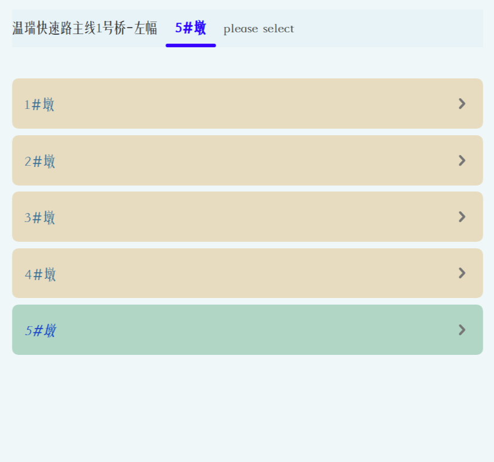

## A Implementation of Cascading Drop Down Menu

### Introduction

This project provides a customizable **Cascading Drop Down Menu** implemented in native JavaScript.



### How to use it?

two source files need be imported.

```html
<script src="TreeList.zjr.1.1.js"></script>
<script src="CascadeList.zjr.1.1.js"></script>
```

then in your script file, you just create a new CascadeList object which can be used just like a component.

```javascript
const data = [['双岙中桥-左幅','0#台','四氟板式橡胶支座','GBZJH350x400x71',7,'非连续墩'],
['双岙中桥-左幅','1#墩','板式橡胶支座','GBZJ450x500x84',7,'连续墩'],
['双岙中桥-左幅','2#墩','板式橡胶支座','GBZJ450x500x84',7,'连续墩'],
['双岙中桥-左幅','3#台','四氟板式橡胶支座','GBZJH350x400x71',7,'非连续墩'],
['双岙中桥-右幅','0#台','四氟板式橡胶支座','GBZJH350x400x71',7,'非连续墩'],
['双岙中桥-右幅','1#墩','板式橡胶支座','GBZJ450x500x84',7,'连续墩'],
['双岙中桥-右幅','2#墩','板式橡胶支座','GBZJ450x500x84',7,'连续墩'],
['双岙中桥-右幅','3#台','四氟板式橡胶支座','GBZJH350x400x71',7,'非连续墩'],
['进星大桥-左幅','0#台','四氟板式橡胶支座','GBZJH400x400x86',7,'非连续墩'],
['进星大桥-左幅','1#墩','板式橡胶支座','GBZJ500x550x90',7,'连续墩'],
['进星大桥-左幅','2#墩','板式橡胶支座','GBZJ500x550x90',7,'连续墩'],
['进星大桥-左幅','3#墩','板式橡胶支座','GBZJ500x550x90',7,'连续墩'],
['进星大桥-左幅','4#台','四氟板式橡胶支座','GBZJH400x400x86',7,'非连续墩'],
['进星大桥-右幅','0#台','四氟板式橡胶支座','GBZJH400x400x86',7,'非连续墩'],
['进星大桥-右幅','1#墩','板式橡胶支座','GBZJ500x550x90',7,'连续墩'],
['进星大桥-右幅','2#墩','板式橡胶支座','GBZJ500x550x90',7,'连续墩'],
['进星大桥-右幅','3#台','四氟板式橡胶支座','GBZJH400x400x86',7,'非连续墩'],
['温瑞快速路主线1号桥-左幅','1#墩','板式橡胶支座','GBZJ500x550x90',7,'连续墩'],
['温瑞快速路主线1号桥-左幅','2#墩','板式橡胶支座','GBZJ500x550x90',7,'连续墩'],
['温瑞快速路主线1号桥-左幅','3#墩','板式橡胶支座','GBZJ500x550x90',7,'连续墩'],
['温瑞快速路主线1号桥-左幅','4#墩','四氟板式橡胶支座','GBZJH400x400x86',7,'非连续墩'],
['温瑞快速路主线1号桥-左幅','4#墩','四氟板式橡胶支座','GBZJH450x450x86',8,'非连续墩'],
['温瑞快速路主线1号桥-左幅','5#墩','板式橡胶支座','GBZJ450x450x84',17,'连续墩'],
['温瑞快速路主线1号桥-左幅','5#墩','板式橡胶支座','GBZJ450x450x84',17,'非连续墩']
];
let cascader = new CascadeList(data, {
    tab_fontSize: 0.6, height: 300, color: {
    item_fs_color: "#0540c8", item_fs_bg: "#b1d6c5", item_bg:"#e3ca9996", item_color: "#377097"
}});
cascader.hook = (x) => {console.log(x)};
document.body.prepend(cascader.node);
cascader.show();
```

### Customized Options


| options        | description                                  |
| :------------- | :------------------------------------------- |
| color          | the color of parts in CascadeList            |
| width          | the width of the CascadeList                 |
| fontSize       | set the overall font size of the CascadeList |
| tab_fontSize   | Font size of List header                     |
| panel_fontSize | The font size of the selection               |
